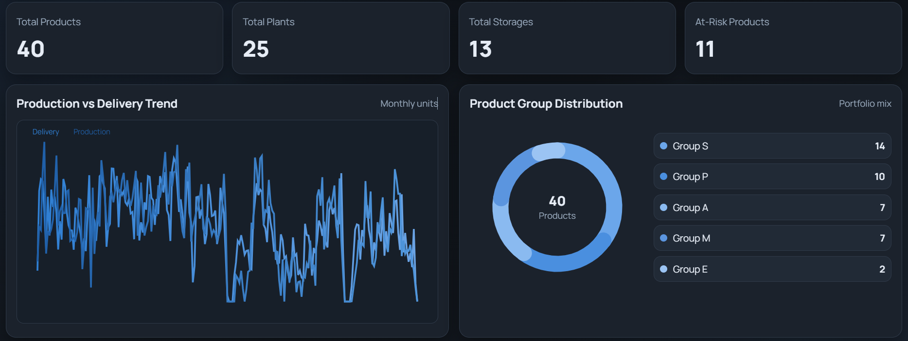
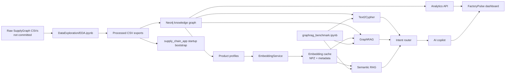
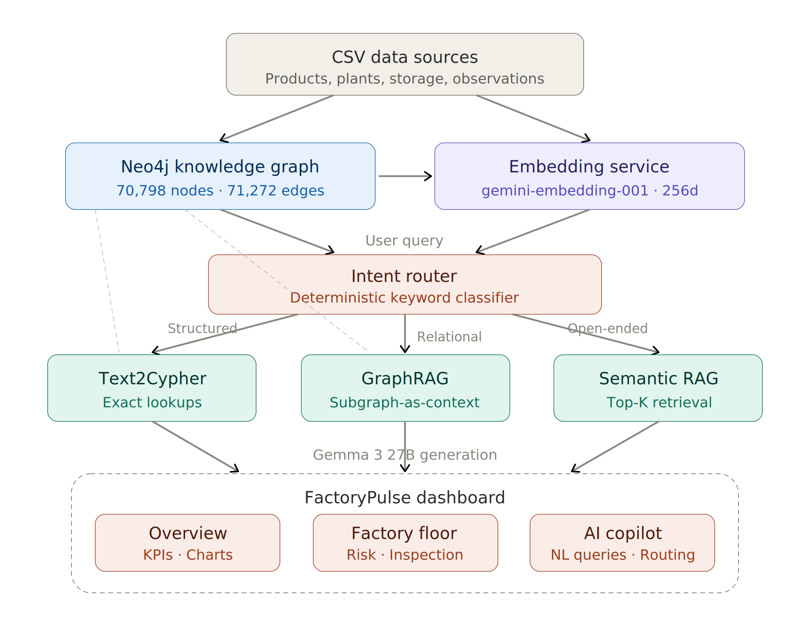
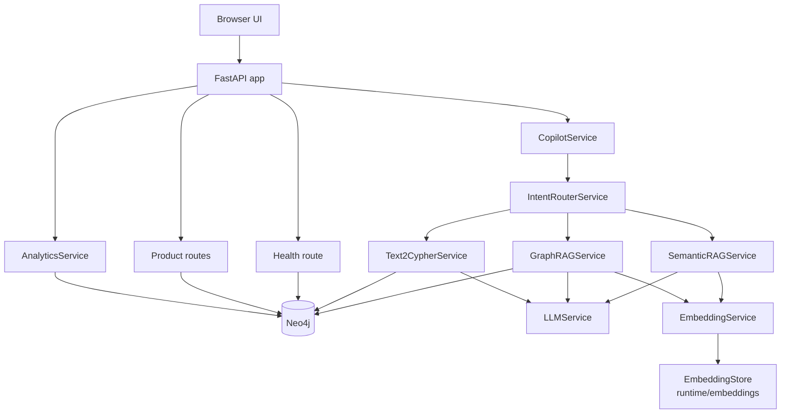
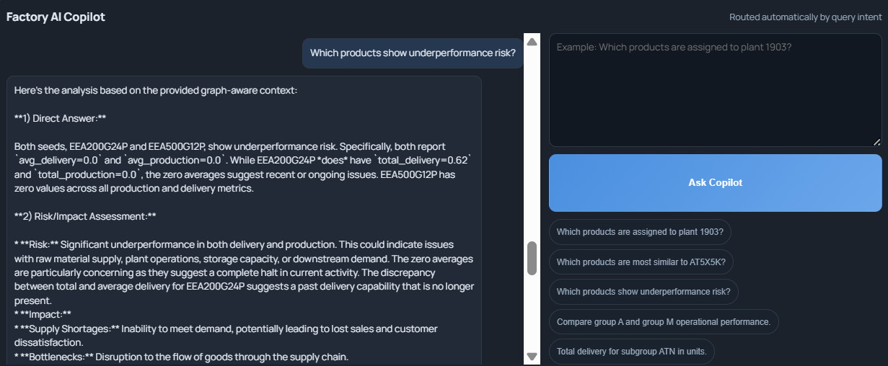

# EventualSmartFactory

Benchmark-routed GraphRAG for supply-chain intelligence, packaged as a production-style FastAPI dashboard with Neo4j, visual analytics, and an AI copilot.

This repository is not just a web app. It contains the full project lifecycle:

1. exploratory data analysis on the SupplyGraph dataset,
2. export of cleaned graph-ready CSVs,
3. graph loading into Neo4j,
4. benchmarking of three retrieval strategies,
5. a deployed dashboard that turns those benchmark findings into a routed AI copilot.



## Table of Contents

- [Project at a glance](#project-at-a-glance)
- [What this repository contains](#what-this-repository-contains)
- [End-to-end workflow](#end-to-end-workflow)
- [Knowledge graph and RAG architecture](#knowledge-graph-and-rag-architecture)
- [Repository layout](#repository-layout)
- [Quick start: run the full stack](#quick-start-run-the-full-stack)
- [Run each part individually](#run-each-part-individually)
- [Configuration reference](#configuration-reference)
- [API surface](#api-surface)
- [What happens on startup](#what-happens-on-startup)
- [Troubleshooting](#troubleshooting)

---

## Project at a glance

| Item | Value |
| --- | --- |
| Main application | `supply_chain_app/` |
| Backend framework | FastAPI |
| Graph database | Neo4j |
| Frontend style | Single-page dashboard served by FastAPI |
| Core AI pattern | Hybrid retrieval with intent routing |
| Retrieval strategies | Semantic RAG, GraphRAG, Text2Cypher |
| Generation model in project materials | `gemma-3-27b-it` |
| Embedding model in project materials | `gemini-embedding-001` |
| Processed products | 40 |
| Unique plants | 25 |
| Unique storage locations | 13 |
| Product-to-plant links | 276 |
| Product-to-storage links | 276 |
| Observation rows | 70,720 |
| Resulting graph size after bootstrap | 70,798 nodes, 71,272 edges |
| Benchmark notebook | `graphrag_benchmark.ipynb` |
| EDA notebook | `DataExploration/EDA.ipynb` |
| Final report | `Reports/FinalReport/main.pdf` |

### What the project does

The project turns supply-chain data into a graph-backed decision-support system. It supports:

- KPI dashboards for products, plants, storages, and time-series flow
- operational risk monitoring based on fulfillment ratios
- product inspection with related-product context
- natural-language copilot queries routed to the best retrieval strategy
- benchmark-backed transparency on why a route was selected

### Why the architecture is hybrid

The benchmark work in `graphrag_benchmark.ipynb` shows that no single retrieval method dominates every question type:

| Approach | Average score | Best at | Main weakness |
| --- | --- | --- | --- |
| GraphRAG | 4.20 / 5 | relational reasoning, similarity, graph-aware context | depends on good seed retrieval |
| Gemini RAG | 4.17 / 5 | broad narrative synthesis | weaker on exact graph lookups |
| Text2Cypher | 3.62 / 5 | exact structured and analytical queries | weaker on fuzzy reasoning |

That is why the app uses deterministic intent routing instead of forcing every question through one pipeline.

---

## What this repository contains

| Area | Purpose | Status in repo |
| --- | --- | --- |
| `DataExploration/EDA.ipynb` | explores raw SupplyGraph data and produces cleaned outputs | notebook committed |
| `DataExploration/Processed/` | cleaned CSV exports used by the app and graph loaders | committed and ready to use |
| `DataLoader.py` | standalone legacy graph loader from processed CSVs into Neo4j | committed |
| `graphrag_benchmark.ipynb` | compares Semantic RAG, Text2Cypher, and GraphRAG | committed |
| `embeddings/` | notebook-level embedding cache | committed |
| `supply_chain_app/` | deployable FastAPI dashboard, API, frontend, loaders, runtime cache | committed |
| `Reports/FinalReport/` | final written report, figures, and compiled PDF | committed |

### Important repository-level notes

- The processed data needed to run the dashboard is already included.
- The raw SupplyGraph dataset used by the EDA notebook is not included in this repository.
- The app can run without a `GEMINI_API_KEY`; it falls back to deterministic offline behavior.
- The benchmark notebook does not have the same offline behavior for judging; it expects live API keys.

---

## End-to-end workflow



### Practical project story

1. `DataExploration/EDA.ipynb` investigates the raw supply-chain dataset and exports cleaned tables.
2. Those tables land in `DataExploration/Processed/`.
3. Neo4j is populated either automatically at app startup, through `supply_chain_app/scripts/load_graph.py`, or through the top-level `DataLoader.py`.
4. The benchmark notebook evaluates three retrieval approaches on a 20-question mixed-intent benchmark.
5. The deployed app encodes those findings in a simple router:
   - structured or analytical questions -> Text2Cypher
   - relational or reasoning questions -> GraphRAG
   - broad open-ended synthesis -> Semantic RAG

---

## Knowledge graph and RAG architecture



### Knowledge graph schema

The graph model implemented in the code is:

| Node | Key fields |
| --- | --- |
| `Product` | `code`, `group`, `subgroup` |
| `Plant` | `id` |
| `Storage` | `id` |
| `Observation` | `obs_key`, `date`, `metric`, `unit_type`, `value` |

| Relationship | Meaning |
| --- | --- |
| `(:Product)-[:ASSIGNED_TO_PLANT]->(:Plant)` | structural production location link |
| `(:Product)-[:STORED_IN]->(:Storage)` | structural storage location link |
| `(:Product)-[:HAS_OBSERVATION]->(:Observation)` | daily metric history |

### Runtime architecture



### What each retrieval strategy does in this repo

| Strategy | How it works here | Used when |
| --- | --- | --- |
| Semantic RAG | top-k embedding search over product profiles, then prompt-based synthesis | open-ended narrative questions |
| GraphRAG | embedding-based seed retrieval, graph neighborhood expansion, metric-aware context serialization | relational and reasoning questions |
| Text2Cypher | heuristic or LLM-generated read-only Cypher, executed against Neo4j, then summarized | exact structural or analytical questions |

### Safety and fallback behavior

- `Text2Cypher` only allows read-only Cypher and blocks write-like clauses such as `CREATE`, `MERGE`, `DELETE`, `SET`, `CALL`, `APOC`, and `LOAD CSV`.
- If `Text2Cypher` fails to generate or safely execute a query, the router falls back to `GraphRAG`.
- If no Gemini key is available:
  - generation falls back to a deterministic offline text response,
  - embeddings fall back to a local hash-based embedding model.

### Dashboard panels

The frontend served from `supply_chain_app/app/frontend/static/` exposes three main panels:

- `Overview`: KPI cards, monthly production vs delivery trend, group distribution, top delivery products, and risk profile
- `Operations`: plant load, storage pressure, risk watchlist, and product explorer
- `AI Copilot`: natural-language questions, route explanation, and optional generated Cypher

The UI auto-refreshes data every 90 seconds.



---

## Repository layout

```text
EventualSmartFactory/
|- docker-compose.yml
|- DataLoader.py
|- graphrag_benchmark.ipynb
|- README.md
|- embeddings/
|  `- gemini_products.npz
|- DataExploration/
|  |- EDA.ipynb
|  `- Processed/
|     |- products.csv
|     |- product_plant.csv
|     |- product_storage.csv
|     `- observations.csv
|- supply_chain_app/
|  |- Dockerfile
|  |- README.md
|  |- requirements.txt
|  |- scripts/
|  |  `- load_graph.py
|  |- runtime/
|  |  `- embeddings/
|  |     |- products.npz
|  |     `- products.meta.json
|  `- app/
|     |- main.py
|     |- api/
|     |- core/
|     |- domain/
|     |- frontend/static/
|     |- repositories/
|     |- services/
|     `- storage/
`- Reports/
   `- FinalReport/
      |- main.tex
      |- main.pdf
      `- figures/
```

### Where to start, depending on your goal

| If you want to... | Start here |
| --- | --- |
| run the full dashboard quickly | `docker-compose.yml` |
| inspect the deployed backend | `supply_chain_app/app/main.py` |
| understand the routing logic | `supply_chain_app/app/services/rag/intent_router.py` |
| inspect graph queries and analytics | `supply_chain_app/app/repositories/neo4j_repository.py` |
| rebuild the graph manually | `supply_chain_app/scripts/load_graph.py` or `DataLoader.py` |
| reproduce EDA | `DataExploration/EDA.ipynb` |
| reproduce benchmark results | `graphrag_benchmark.ipynb` |
| read the write-up | `Reports/FinalReport/main.pdf` |

---

## Quick start: run the full stack

This is the easiest and most faithful way to run the project.

### Prerequisites

- Docker Desktop with Compose support
- an optional `GEMINI_API_KEY` if you want live LLM answers instead of offline fallback behavior

### From the repository root

PowerShell:

```powershell
# Optional: only needed for live Gemini-backed generation and embeddings
$env:GEMINI_API_KEY="your_key_here"

docker compose up --build
```

Then open:

- Dashboard: `http://localhost:8000`
- FastAPI docs: `http://localhost:8000/docs`
- Health endpoint: `http://localhost:8000/api/v1/health`
- Neo4j Browser: `http://localhost:7474`

Neo4j default credentials from `docker-compose.yml`:

- username: `neo4j`
- password: `password`

### What Docker Compose starts

`docker-compose.yml` starts two services:

- `neo4j`
- `supply_chain_app`

It also mounts:

- `./DataExploration/Processed` into the app as read-only processed input data
- `./supply_chain_app/runtime` into the app for persistent embedding cache reuse

### First-start behavior

On first startup, if Neo4j is empty and `AUTO_BOOTSTRAP_DATA=true`, the app will:

1. create constraints and indexes,
2. import the processed CSVs into Neo4j,
3. fetch product profiles,
4. build or reuse product embeddings,
5. start serving the frontend and API.

The very first run can take longer than later runs because of bootstrap and embedding initialization.

---

## Run each part individually

### 1. Run Neo4j only

Useful when you want the database available for the notebooks or a local app run.

```powershell
docker compose up -d neo4j
```

Then open `http://localhost:7474` and log in with:

- username: `neo4j`
- password: `password`

### 2. Run the FastAPI app locally without Docker

This is helpful if you want code reloads or to work directly inside `supply_chain_app/`.

### Prerequisites

- Python 3.11 recommended, matching the Dockerfile
- Neo4j already running locally or via `docker compose up -d neo4j`

### Install dependencies

```powershell
cd supply_chain_app
python -m venv .venv
.\.venv\Scripts\Activate.ps1
python -m pip install --upgrade pip
python -m pip install -r requirements.txt
```

### Set environment variables

The app defaults are container-style paths such as `/app/data/processed`, so for local host runs you should override them.

```powershell
$env:NEO4J_URI="bolt://localhost:7687"
$env:NEO4J_USER="neo4j"
$env:NEO4J_PASSWORD="password"
$env:NEO4J_DATABASE="neo4j"

# Optional
$env:GEMINI_API_KEY="your_key_here"

# Important for host execution
$env:PROCESSED_DATA_DIR="../DataExploration/Processed"
$env:EMBEDDING_CACHE_NPZ="./runtime/embeddings/products.npz"
$env:EMBEDDING_CACHE_META="./runtime/embeddings/products.meta.json"
$env:AUTO_BOOTSTRAP_DATA="true"
```

### Start the app

```powershell
python -m uvicorn app.main:app --host 0.0.0.0 --port 8000 --reload
```

Open:

- `http://localhost:8000`
- `http://localhost:8000/docs`

### 3. Run the app-aligned graph bootstrap script

The recommended explicit loader is `supply_chain_app/scripts/load_graph.py`.

Why use it:

- it uses the same config model as the deployed app,
- it only bootstraps if the graph is empty,
- it is the safest manual loading path in this repository.

From inside `supply_chain_app/`:

```powershell
$env:NEO4J_URI="bolt://localhost:7687"
$env:NEO4J_USER="neo4j"
$env:NEO4J_PASSWORD="password"
$env:NEO4J_DATABASE="neo4j"
$env:PROCESSED_DATA_DIR="../DataExploration/Processed"

python scripts/load_graph.py
```

### 4. Run the standalone top-level `DataLoader.py`

This is a second, older loader that reads directly from `DataExploration/Processed`.

### Install what it needs

From the repository root:

```powershell
python -m venv .venv
.\.venv\Scripts\Activate.ps1
python -m pip install --upgrade pip
python -m pip install pandas neo4j
```

### Set environment variables

```powershell
$env:NEO4J_URI="bolt://localhost:7687"
$env:NEO4J_USER="neo4j"
$env:NEO4J_PASSWORD="password"
$env:BATCH_SIZE="5000"
$env:CLEAR_EXISTING="false"
```

### Run it

```powershell
python DataLoader.py
```

### Important warning

If you set:

```powershell
$env:CLEAR_EXISTING="true"
```

the script will delete the current Neo4j graph before reloading it.

### 5. Run the EDA notebook

Notebook file:

- `DataExploration/EDA.ipynb`

### What it expects

The notebook auto-detects raw data in either:

- `RawData/`
- `DataExploration/RawData/`

with a structure similar to:

```text
RawData/
|- Nodes/
|- Edges/
`- Temporal Data/
   |- Unit/
   `- Weight/
```

### Important note

Those raw source files are not committed here. The notebook is present, but it will only run end-to-end if you supply the original raw dataset in one of the expected locations.

### Install notebook dependencies

```powershell
python -m pip install -r supply_chain_app/requirements.txt
python -m pip install jupyterlab matplotlib seaborn networkx scikit-learn tqdm
```

### Launch it

```powershell
jupyter lab DataExploration/EDA.ipynb
```

### What it produces

The notebook exports the cleaned CSVs used by the app into:

- `DataExploration/Processed/products.csv`
- `DataExploration/Processed/product_plant.csv`
- `DataExploration/Processed/product_storage.csv`
- `DataExploration/Processed/observations.csv`

Because those files are already committed, you do not need to rerun the notebook just to run the dashboard.

### 6. Run the benchmark notebook

Notebook file:

- `graphrag_benchmark.ipynb`

### What it needs

- Neo4j running and loaded with the graph
- `GEMINI_API_KEY`
- `DEEPSEEK_API_KEY`

### Install notebook dependencies

```powershell
python -m pip install -r supply_chain_app/requirements.txt
python -m pip install jupyterlab matplotlib seaborn networkx scikit-learn tqdm
```

### Set environment variables

```powershell
$env:NEO4J_URI="bolt://localhost:7687"
$env:NEO4J_USER="neo4j"
$env:NEO4J_PASSWORD="password"
$env:GEMINI_API_KEY="your_gemini_key"
$env:DEEPSEEK_API_KEY="your_deepseek_key"

# Optional
$env:DEEPSEEK_JUDGE_MODEL="deepseek-chat"
```

### Launch it

```powershell
jupyter lab graphrag_benchmark.ipynb
```

### What the notebook covers

- graph extraction from Neo4j
- graph visualization
- semantic embedding retrieval
- Text2Cypher generation
- GraphRAG subgraph-as-context retrieval
- a 20-question benchmark across structural, analytical, semantic, and reasoning prompts
- LLM-as-judge scoring
- final comparison plots and summary tables

### Notebook-specific cache

The benchmark notebook uses a separate embedding cache under:

- `embeddings/gemini_products.npz`

This is distinct from the app runtime cache under:

- `supply_chain_app/runtime/embeddings/`

### 7. Read or rebuild the final report

The report already exists as:

- `Reports/FinalReport/main.pdf`

If you want to rebuild it, use a LaTeX distribution such as MiKTeX or TeX Live.

```powershell
cd Reports/FinalReport
pdflatex main.tex
pdflatex main.tex
```

Running `pdflatex` twice is usually enough for stable references and layout in this project because the references are written directly in the document rather than through a separate `.bib` pipeline.

---

## Configuration reference

### Core app variables

These are the most important environment variables for the dashboard app.

| Variable | Default in code | Required | Purpose |
| --- | --- | --- | --- |
| `NEO4J_URI` | `bolt://localhost:7687` | yes | Neo4j connection URI |
| `NEO4J_USER` | `neo4j` | yes | Neo4j username |
| `NEO4J_PASSWORD` | `password` | yes | Neo4j password |
| `NEO4J_DATABASE` | `neo4j` | no | Neo4j database name |
| `GEMINI_API_KEY` | empty | no | enables live Gemini generation and remote embeddings |
| `PROCESSED_DATA_DIR` | `/app/data/processed` | effectively yes | source directory for bootstrap CSVs |
| `EMBEDDING_CACHE_NPZ` | `/app/runtime/embeddings/products.npz` | no | vector cache path |
| `EMBEDDING_CACHE_META` | `/app/runtime/embeddings/products.meta.json` | no | vector metadata path |
| `AUTO_BOOTSTRAP_DATA` | `true` | no | import processed data into an empty graph at startup |
| `BOOTSTRAP_BATCH_SIZE` | `5000` | no | load batch size |

### Benchmark variables

| Variable | Default | Required | Purpose |
| --- | --- | --- | --- |
| `GEMINI_API_KEY` | none | yes for benchmark notebook | retrieval and generation in notebook |
| `DEEPSEEK_API_KEY` | none | yes for benchmark notebook | judge model access |
| `DEEPSEEK_JUDGE_MODEL` | `deepseek-chat` | no | judge model name |
| `DEEPSEEK_BASE_URL` | `https://api.deepseek.com/v1/chat/completions` | no | custom judge endpoint override |

### `DataLoader.py` variables

| Variable | Default | Required | Purpose |
| --- | --- | --- | --- |
| `NEO4J_URI` | `bolt://localhost:7687` | yes | Neo4j connection |
| `NEO4J_USER` | `neo4j` | yes | Neo4j username |
| `NEO4J_PASSWORD` | `password` | yes | Neo4j password |
| `BATCH_SIZE` | `5000` | no | row batch size |
| `CLEAR_EXISTING` | `false` | no | delete existing graph before reload |

<details>
<summary>Advanced app defaults from <code>supply_chain_app/app/core/config.py</code></summary>

| Setting | Default |
| --- | --- |
| `APP_NAME` | `Supply Chain Intelligence Hub` |
| `APP_VERSION` | `2.0.0` |
| `API_PREFIX` | `/api/v1` |
| `LLM_MODEL` | `gemma-3-27b-it` |
| `EMBED_MODEL` | `gemini-embedding-001` |
| `EMBEDDING_DIMS` | `3072` |
| `SEMANTIC_TOP_K` | `4` |
| `GRAPHRAG_SEED_K` | `2` |
| `GRAPHRAG_PEER_LIMIT` | `12` |
| `LLM_TIMEOUT_SECONDS` | `45` |

</details>

---

## API surface

Base prefix:

- `/api/v1`

### Main endpoints

| Method | Route | What it returns |
| --- | --- | --- |
| `GET` | `/api/v1/health` | Neo4j and embedding readiness |
| `GET` | `/api/v1/benchmark/strategy` | benchmark summary and routing policy |
| `GET` | `/api/v1/analytics/dashboard` | KPIs, group mix, top delivery, monthly flow |
| `GET` | `/api/v1/analytics/risk?limit=25` | risk watchlist ranked by fulfillment ratio |
| `GET` | `/api/v1/analytics/factory-floor?plant_limit=12&storage_limit=12` | plant load, storage pressure, network density |
| `GET` | `/api/v1/products?group=A&limit=100` | product list with optional group filter |
| `GET` | `/api/v1/products/{code}` | product detail, recent observations, related products |
| `POST` | `/api/v1/copilot/query` | routed AI answer, strategy, sources, optional Cypher |

### Example copilot request

```bash
curl -X POST http://localhost:8000/api/v1/copilot/query \
  -H "Content-Type: application/json" \
  -d "{\"question\":\"Which products are assigned to plant 1903?\"}"
```

### What the copilot response includes

- `strategy`
- `route_reason`
- `benchmark_reference`
- `answer`
- `sources`
- `cypher` when the route is `Text2Cypher`
- `debug_context`
- `generated_at`

---

## What happens on startup

The startup path in `supply_chain_app/app/main.py` and `supply_chain_app/app/services/container.py` is:

1. build the `AppContainer`,
2. connect to Neo4j,
3. optionally bootstrap the graph from processed CSVs if it is empty,
4. fetch product profiles from Neo4j,
5. build or load embedding cache,
6. expose API routes and the static dashboard,
7. serve `/` as the SPA entry point and `/static/*` for assets.

This means a healthy app startup is more than just "the server is listening"; it implies database connectivity and embedding readiness.

---

## Troubleshooting

- If `docker compose up` fails around the Neo4j data volume, create a root-level `Data/` directory because the compose file binds Neo4j persistence there.
- If the app starts but the copilot keeps replying with "offline fallback", set `GEMINI_API_KEY`.
- If a local host run cannot find processed CSVs, make sure `PROCESSED_DATA_DIR` points to `../DataExploration/Processed` from inside `supply_chain_app/`.
- If the benchmark notebook says `DEEPSEEK_API_KEY is missing`, add it to the environment before opening the notebook.
- If `DataExploration/EDA.ipynb` cannot find raw data, place the original dataset under `RawData/` or `DataExploration/RawData/` with the expected folder structure.
- If Neo4j is running but the app reports degraded health, check `http://localhost:8000/api/v1/health` and verify that the graph was actually loaded and embeddings were built.
- If you want a safe manual graph import path, prefer `supply_chain_app/scripts/load_graph.py` over `DataLoader.py` because it does not clear an existing graph.

---

## Recommended reading order

If you want to understand the whole project with the least friction:

1. read this root README,
2. open `Reports/FinalReport/main.pdf`,
3. inspect `supply_chain_app/app/services/container.py`,
4. inspect `supply_chain_app/app/services/rag/`,
5. inspect `graphrag_benchmark.ipynb`,
6. inspect `DataExploration/EDA.ipynb` if you want the preprocessing story.

---

## Closing summary

EventualSmartFactory is best understood as a complete applied GenAI systems project rather than a single app folder. The repository already contains the processed data, the benchmark notebook, the dashboard, and the final report, so the fastest path is to run Docker Compose and open the dashboard. The main things that are optional are the live LLM API keys and the raw source dataset for reproducing the EDA from scratch.
